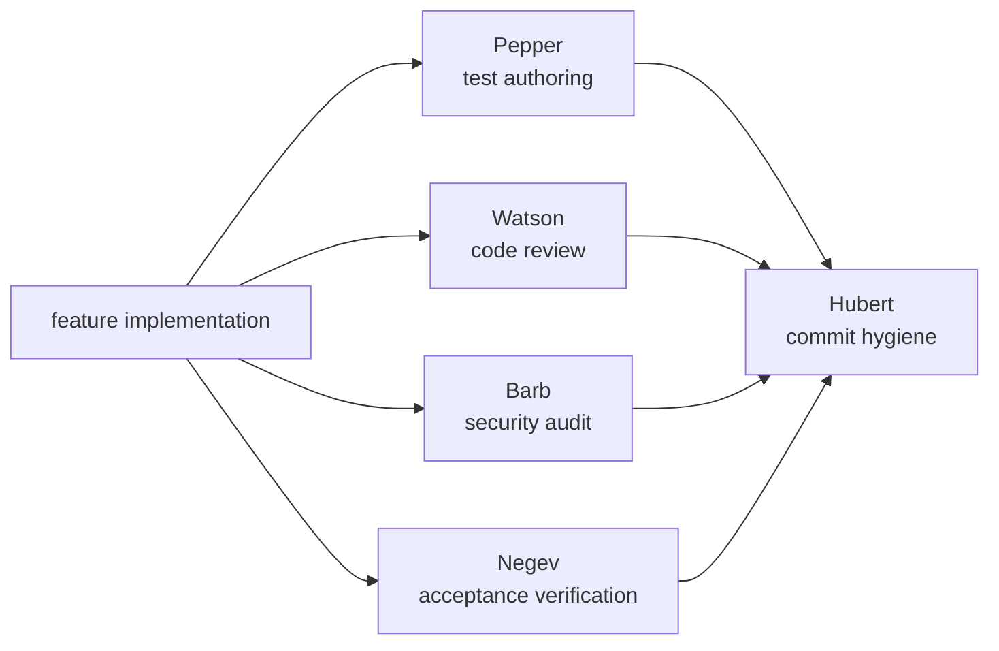

# Claude Dev Team

**Five AI engineering personas that ship software together.**

A Claude Code plugin bundling five named personas — **Hubert**, **Watson**, **Barb**, **Pepper**, and **Negev** — and the workflow skills each one reads. Each persona owns a narrow slice of the software-delivery loop: commit hygiene, code review, security audit, test authoring, and acceptance exploration. Every skill is skill-creator-compliant (lean `SKILL.md`, progressive disclosure via `references/*.md`, imperative voice, description-as-trigger).



---

## The team

| Persona | Paired skill | Role |
|---------|--------------|------|
| **Hubert** | `git-workflow-and-versioning` | Atomic commits, branch hygiene, secrets scan, ≤70-char subject cap. Refuses force-push to main and destructive ops without explicit authorization. |
| **Watson** | `code-review-and-quality` | Five-axis review (correctness, readability, architecture, security, performance). Returns APPROVE or REQUEST CHANGES with categorized findings. |
| **Barb** | `security-and-hardening` | OWASP Top 10 audit, severity classification, remediation guidance with proof-of-concept for Critical/High findings. |
| **Pepper** | `test-driven-development` | Test-suite authoring, coverage analysis, Prove-It pattern for bug reproduction. Writes failing tests first; hands back before fixes. |
| **Negev** | `acceptance-exploration` | End-to-end feature verification across browser / CLI / HTTP API / agent-skill surfaces at stage-appropriate depth (prototype / MVP / beta / GA). |

Each persona reads its paired skill at the start of every operation (single source of truth), then layers persona-specific execution — result-line contract, tool scope, refusal conditions — on top.

---

## Install

<details>
<summary><b>Claude Code — Marketplace (recommended)</b></summary>

```
/plugin marketplace add jasonjgarcia24/claude-dev-team
/plugin install claude-dev-team@jason-claude-dev-team
/reload-plugins
/claude-dev-team:init
```

The first two add the marketplace and install the plugin; the third reloads the current session so the new content is callable without restarting Claude Code. The fourth (`/claude-dev-team:init`) creates user-level symlinks at `~/.claude/skills/<skill>/` pointing into the plugin install — required because the personified agents read their paired skills via that stable path. Idempotent; re-run after any `/plugin install` to keep the symlinks pointed at the current installed version.

To pull a newer version later, run `/plugin marketplace update jason-claude-dev-team`, then `/plugin install claude-dev-team@jason-claude-dev-team`, then `/reload-plugins`, then `/claude-dev-team:init` again.

The install wires up the five agents, five paired skills (plus `browser-testing-with-devtools` as a dependency of Negev's browser surface), and the `/build`, `/test`, and `/init` slash commands. Invoke personas by name:

```
Ask Hubert to commit the current diff as atomic commits.
Have Watson review the changes on this branch.
Run Barb on the auth module.
Pepper: write a failing test for the bug in #42.
Negev: run acceptance on the checkout flow at MVP depth.
```

> **SSH errors?** The marketplace clones repos via SSH. If you don't have SSH keys set up on GitHub, either [add your SSH key](https://docs.github.com/en/authentication/connecting-to-github-with-ssh/adding-a-new-ssh-key-to-your-github-account) or switch to HTTPS for fetches only:
> ```bash
> git config --global url."https://github.com/".insteadOf "git@github.com:"
> ```

</details>

<details>
<summary><b>Claude Code — Local / development clone</b></summary>

Useful if you want to edit the agents or skills in place.

```bash
git clone https://github.com/jasonjgarcia24/claude-dev-team.git ~/code/claude-dev-team
claude --plugin-dir ~/code/claude-dev-team
```

</details>

<details>
<summary><b>Manual install (no plugin marketplace)</b></summary>

Bolt-on to an existing Claude Code config without the marketplace. Creates user-level symlinks under `~/.claude/`, matching how the `my-claude-tools` monorepo deploys these bundles.

```bash
git clone https://github.com/jasonjgarcia24/claude-dev-team.git ~/claude-dev-team
cd ~/claude-dev-team

# 5 personas
mkdir -p ~/.claude/agents
for agent in git-workflow code-reviewer security-auditor test-engineer acceptance-explorer; do
  ln -sf "$PWD/agents/$agent.md" "$HOME/.claude/agents/$agent.md"
done

# 5 personified skills + 1 dependency (browser-testing-with-devtools)
mkdir -p ~/.claude/skills
for skill in git-workflow-and-versioning code-review-and-quality security-and-hardening \
             test-driven-development acceptance-exploration browser-testing-with-devtools; do
  ln -sf "$PWD/skills/$skill" "$HOME/.claude/skills/$skill"
done

# 2 slash commands
mkdir -p ~/.claude/commands
for cmd in build test; do
  ln -sf "$PWD/commands/$cmd.md" "$HOME/.claude/commands/$cmd.md"
done
```

The manual install gets you the un-namespaced forms (`hubert`, `watson`, etc.); the marketplace install uses `claude-dev-team:<name>` namespacing.

</details>

---

## How the team works

The personas are **parallel specialists, not a linear pipeline**. Invoke whichever one fits the current task. The `/build` and `/test` slash commands orchestrate Pepper, the TDD skill, and Hubert as needed.

**Separation of concerns (enforced in every persona's prompt):**

- **Hubert** does commit hygiene. Does NOT review code quality (that's Watson) or run tests (that's Pepper).
- **Watson** reviews the diff. Does NOT commit (Hubert) or verify runtime behavior (Negev).
- **Barb** audits security. Does NOT write hardening code — the `security-and-hardening` skill does, invoked by the main agent.
- **Pepper** writes tests. Does NOT implement fixes — the main agent does, after Pepper's failing test lands.
- **Negev** verifies end-to-end. Does NOT write tests (Pepper), review code (Watson), or commit (Hubert).

Each persona ends its response with a verified result line the caller can surface verbatim:

```
hubert: committed a1b2c3d "feat: add email validation" ✓
watson: request changes — 2 critical, 3 important ✗
barb: cleared — 6 files, 0 critical, 1 high, 2 medium ✓
pepper: bug reproduced — failing test at src/auth.test.ts:42 ✓
negev: acceptance passed — MVP, browser, 4 flows verified ✓
```

Result lines are the contract between the persona and the calling agent — they're machine-parseable, always last, and the caller surfaces them as-is.

---

## Project structure

```
claude-dev-team/
├── .claude-plugin/
│   ├── marketplace.json       # enables /plugin marketplace add
│   └── plugin.json            # plugin manifest
├── agents/
│   ├── acceptance-explorer.md (Negev)
│   ├── code-reviewer.md       (Watson)
│   ├── git-workflow.md        (Hubert)
│   ├── security-auditor.md    (Barb)
│   └── test-engineer.md       (Pepper)
├── skills/
│   ├── acceptance-exploration/
│   │   ├── SKILL.md
│   │   └── references/        (one per surface: browser/CLI/HTTP API/agent-skill)
│   ├── browser-testing-with-devtools/   (dependency of acceptance-exploration)
│   ├── code-review-and-quality/
│   │   ├── SKILL.md
│   │   └── references/        (review-culture, advanced-patterns)
│   ├── git-workflow-and-versioning/
│   │   ├── SKILL.md
│   │   └── references/        (worktrees, debugging-with-git)
│   ├── security-and-hardening/
│   │   ├── SKILL.md
│   │   └── references/        (owasp-patterns, operational-security, checklist)
│   └── test-driven-development/
│       ├── SKILL.md
│       └── references/        (anti-patterns, subagent-delegation)
├── commands/
│   ├── build.md               # /build — incremental feature work (invokes Pepper + Hubert)
│   └── test.md                # /test — TDD workflow, Prove-It for bugs
├── README.md
└── LICENSE
```

Each `SKILL.md` body is lean (<300 lines); variant content lives in `references/*.md` and loads on-demand. The paired persona's agent file (~50–110 lines each) contains only the persona-specific execution delta — no duplication of skill content.

---

## Requirements

- **Claude Code CLI** — this is a Claude Code plugin; it runs inside a Claude Code session.
- **Chrome DevTools MCP** — only required if you invoke Negev on a browser surface. Other surfaces (CLI, HTTP API, agent-skill) don't need it.

No API keys, OAuth, or external services required.

---

## Origin

Derived from [Addy Osmani's `agent-skills`](https://github.com/addyosmani/agent-skills). The personified agent layer (Hubert / Watson / Barb / Pepper / Negev), the paired-agent discipline pattern, the `acceptance-exploration` skill, and the skill-creator-compliance refactor pass were developed in [Jason J. Garcia's `my-claude-tools` monorepo](https://github.com/jasonjgarcia24/my-claude-tools). Extracted here as a self-contained plugin for easier sharing.

---

## License

MIT — see [LICENSE](LICENSE). Attribution:

- Upstream engineering skills: © 2025 Addy Osmani (original `agent-skills`)
- Personas, `acceptance-exploration`, skill-creator-compliance refactor: © 2026 Jason J. Garcia
