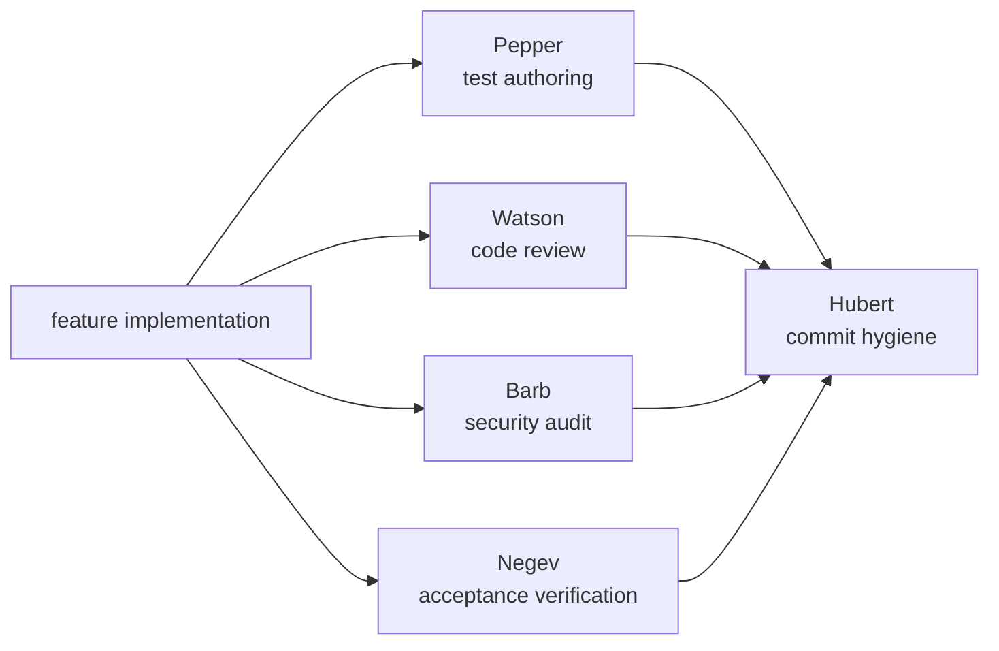
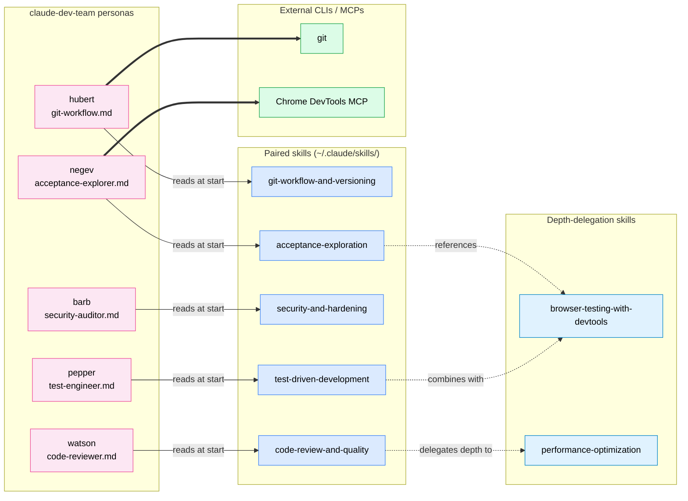
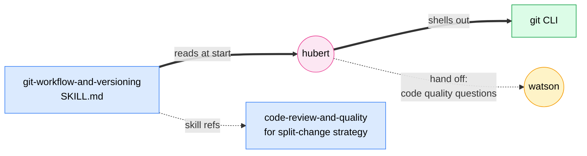
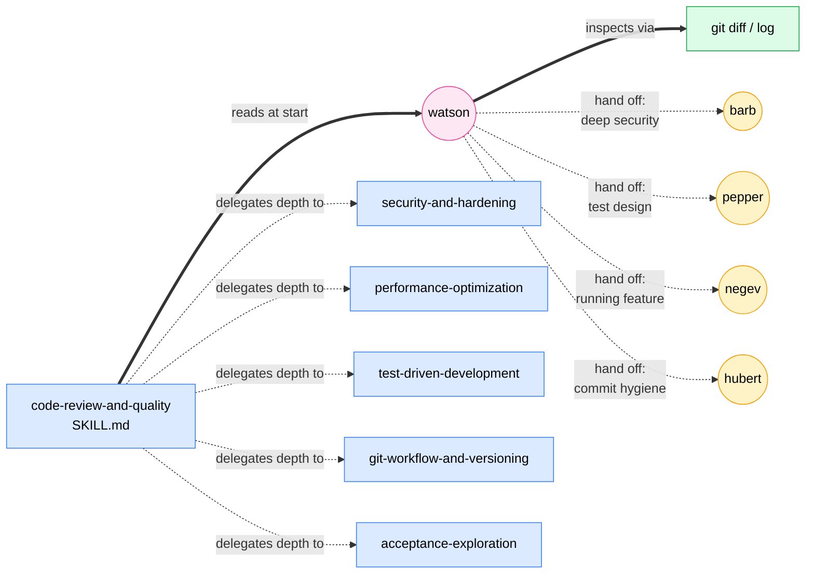
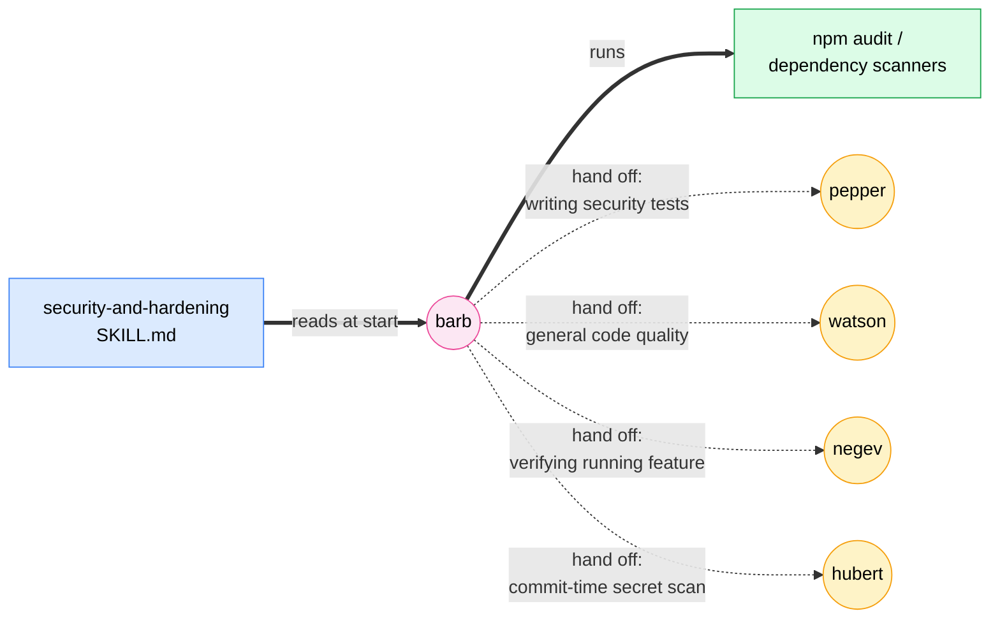
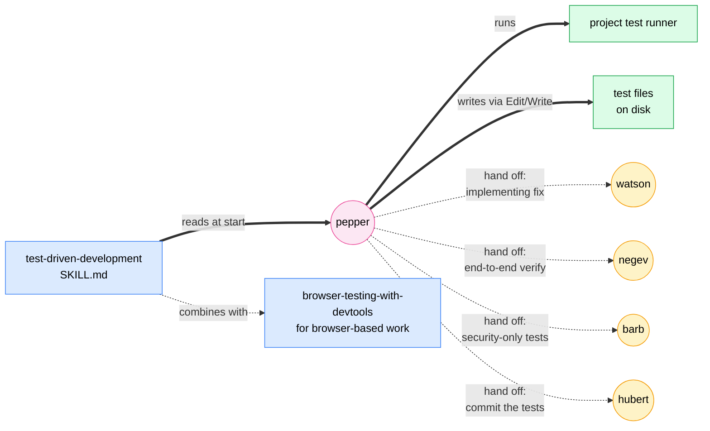
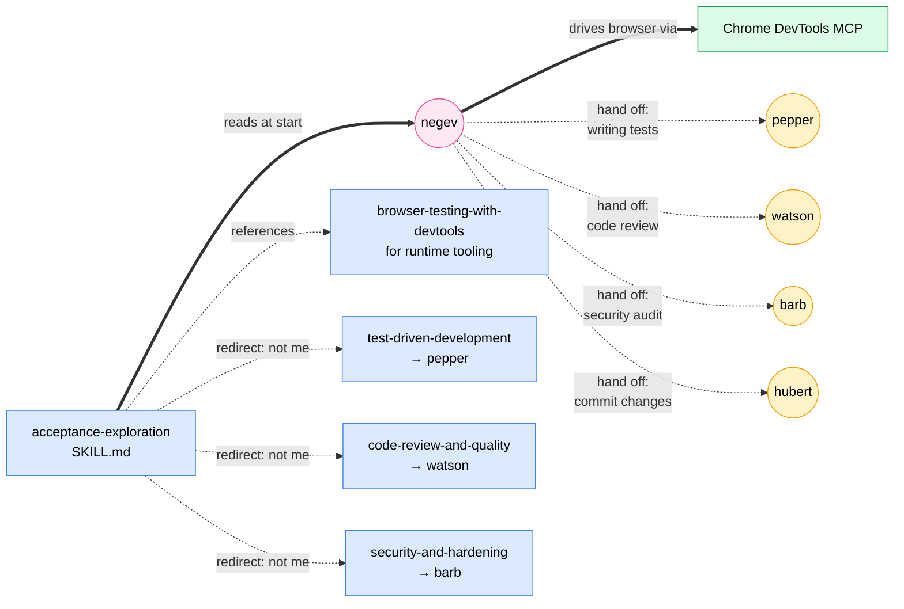

# Claude Dev Team

**Five AI engineering personas that ship software together.**

A Claude Code plugin bundling five named personas — **Hubert**, **Watson**, **Barb**, **Pepper**, and **Negev** — and the workflow skills each one reads. Each persona owns a narrow slice of the software-delivery loop: commit hygiene, code review, security audit, test authoring, and acceptance exploration. Every skill is skill-creator-compliant (lean `SKILL.md`, progressive disclosure via `references/*.md`, imperative voice, description-as-trigger).



---

## The team

| Persona | Paired skill | Role |
|---------|--------------|------|
| **Hubert** | `git-workflow-and-versioning` | Atomic commits, branch hygiene, secrets scan, ≤70-char subject cap. Refuses force-push to main and destructive ops without explicit authorization. |
| **Watson** | `code-review-and-quality` | Five-axis review (correctness, readability, architecture, security, performance). Returns APPROVE or REQUEST CHANGES with categorized findings. |
| **Barb** | `security-and-hardening` | OWASP Top 10 audit, severity classification, remediation guidance with proof-of-concept for Critical/High findings. |
| **Pepper** | `test-driven-development` | Test-suite authoring, coverage analysis, Prove-It pattern for bug reproduction. Writes failing tests first; hands back before fixes. |
| **Negev** | `acceptance-exploration` | End-to-end feature verification across browser / CLI / HTTP API / agent-skill surfaces at stage-appropriate depth (prototype / MVP / beta / GA). |

Each persona reads its paired skill at the start of every operation (single source of truth), then layers persona-specific execution — result-line contract, tool scope, refusal conditions — on top.

---

## Quick Start

> **Before you start:** this plugin runs entirely inside Claude Code — no API keys, OAuth, or external accounts required. Chrome DevTools MCP is optional (only needed if you invoke Negev on a browser surface). See [Requirements](#requirements).

<details>
<summary><b>Claude Code — Marketplace install (recommended)</b></summary>

```
/plugin marketplace add jasonjgarcia24/claude-dev-team
/plugin install claude-dev-team@jason-claude-dev-team
/reload-plugins
/claude-dev-team:init
```

The first two add the marketplace and install the plugin; the third reloads the current session so the new content is callable without restarting Claude Code. The fourth (`/claude-dev-team:init`) creates 13 user-level symlinks — 5 agents at `~/.claude/agents/`, 6 skills at `~/.claude/skills/`, and 2 commands at `~/.claude/commands/` — all pointing into the plugin install. This serves two purposes: (1) it lets the personified agents read their paired skills via the stable `~/.claude/skills/<name>/SKILL.md` paths they hardcode, and (2) it makes the personas + commands accessible by short name (`hubert`, `/build`) in addition to the namespaced form (`claude-dev-team:hubert`, `/claude-dev-team:build`). Idempotent; re-run after any `/plugin install` to keep the symlinks pointed at the current installed version.

To pull a newer version later: **uninstall first then reinstall** (Claude Code's `/plugin install` skips already-installed plugins, so a vanilla rerun won't pick up upstream changes):

```
/plugin marketplace update jason-claude-dev-team
/plugin uninstall claude-dev-team@jason-claude-dev-team
/plugin install claude-dev-team@jason-claude-dev-team
/reload-plugins
/claude-dev-team:init
```

> **Two ways to invoke each persona and command.** `claude-dev-team:hubert` / `/claude-dev-team:build` are the plugin-namespaced forms (always available after install — Claude Code namespaces plugin content as `<plugin-name>:<name>` to avoid collisions). `hubert` / `/build` are the short forms — during `/claude-dev-team:init`, user-level symlinks are installed at `~/.claude/agents/<persona>.md` and `~/.claude/commands/<command>.md` pointing at the plugin's files, so both resolve to the same content with no drift. (Init itself stays namespaced — `/claude-dev-team:init` only — because Claude Code has a built-in `/init` command for CLAUDE.md initialization that the short form would collide with.)

The install wires up the five agents, five paired skills, two depth-delegation skills (`browser-testing-with-devtools` for Negev's browser surface, `performance-optimization` for Watson's perf-axis depth), and the `/build` and `/test` slash commands. Invoke personas by name:

```
Ask Hubert to commit the current diff as atomic commits.
Have Watson review the changes on this branch.
Run Barb on the auth module.
Pepper: write a failing test for the bug in #42.
Negev: run acceptance on the checkout flow at MVP depth.
```

> **SSH errors?** The marketplace clones repos via SSH. If you don't have SSH keys set up on GitHub, either [add your SSH key](https://docs.github.com/en/authentication/connecting-to-github-with-ssh/adding-a-new-ssh-key-to-your-github-account) or switch to HTTPS for fetches only:
> ```bash
> git config --global url."https://github.com/".insteadOf "git@github.com:"
> ```

</details>

<details>
<summary><b>Uninstall</b></summary>

Three steps. The first cleans up the user-level shims init created; the next two remove the plugin and marketplace.

```
/claude-dev-team:init --remove
/plugin uninstall claude-dev-team@jason-claude-dev-team
/plugin marketplace remove jason-claude-dev-team
```

**`--remove` removes** (only if they exist and point at `claude-dev-team` paths):

- 5 agent symlinks at `~/.claude/agents/{git-workflow,code-reviewer,security-auditor,test-engineer,acceptance-explorer}.md`
- 7 skill symlinks at `~/.claude/skills/{git-workflow-and-versioning,code-review-and-quality,security-and-hardening,test-driven-development,acceptance-exploration,browser-testing-with-devtools,performance-optimization}`
- 2 command symlinks at `~/.claude/commands/{build,test}.md`

Symlinks pointing elsewhere (e.g., from another bundle or a manual install you did yourself) are left alone — `--remove` verifies the target contains `claude-dev-team` before deleting.

**`--remove` does NOT touch** — this plugin doesn't create sensitive state, so there's nothing extra to clean up. Specifically:

- No `~/.config/claude-dev-team/` — the plugin has no config or credentials on disk.
- No entries in `~/.claude/settings.json` — the plugin ships no `settings.fragment.json`, so nothing is merged into your settings.
- No external state (no OAuth tokens, no remote account links, no external service state).

Running the three commands above is a complete uninstall — no manual cleanup needed.

</details>

<details>
<summary><b>Claude Code — Local / development clone</b></summary>

Useful if you want to edit the agents or skills in place.

```bash
git clone https://github.com/jasonjgarcia24/claude-dev-team.git ~/code/claude-dev-team
claude --plugin-dir ~/code/claude-dev-team
```

</details>

<details>
<summary><b>Manual install (no plugin marketplace)</b></summary>

Bolt-on to an existing Claude Code config without the marketplace. Creates user-level symlinks under `~/.claude/`, matching how the `my-claude-tools` monorepo deploys these bundles.

```bash
git clone https://github.com/jasonjgarcia24/claude-dev-team.git ~/claude-dev-team
cd ~/claude-dev-team

# 5 personas
mkdir -p ~/.claude/agents
for agent in git-workflow code-reviewer security-auditor test-engineer acceptance-explorer; do
  ln -sf "$PWD/agents/$agent.md" "$HOME/.claude/agents/$agent.md"
done

# 5 personified skills + 2 depth-delegation skills (browser-testing-with-devtools, performance-optimization)
mkdir -p ~/.claude/skills
for skill in git-workflow-and-versioning code-review-and-quality security-and-hardening \
             test-driven-development acceptance-exploration browser-testing-with-devtools \
             performance-optimization; do
  ln -sf "$PWD/skills/$skill" "$HOME/.claude/skills/$skill"
done

# 2 slash commands
mkdir -p ~/.claude/commands
for cmd in build test; do
  ln -sf "$PWD/commands/$cmd.md" "$HOME/.claude/commands/$cmd.md"
done
```

The manual install gets you the un-namespaced forms (`hubert`, `watson`, etc.); the marketplace install uses `claude-dev-team:<name>` namespacing.

</details>

---

## How the team works

The personas are **parallel specialists, not a linear pipeline**. Invoke whichever one fits the current task. The `/build` and `/test` slash commands orchestrate Pepper, the TDD skill, and Hubert as needed.

**Separation of concerns (enforced in every persona's prompt):**

- **Hubert** does commit hygiene. Does NOT review code quality (that's Watson) or run tests (that's Pepper).
- **Watson** reviews the diff. Does NOT commit (Hubert) or verify runtime behavior (Negev).
- **Barb** audits security. Does NOT write hardening code — the `security-and-hardening` skill does, invoked by the main agent.
- **Pepper** writes tests. Does NOT implement fixes — the main agent does, after Pepper's failing test lands.
- **Negev** verifies end-to-end. Does NOT write tests (Pepper), review code (Watson), or commit (Hubert).

Each persona ends its response with a verified result line the caller can surface verbatim:

```
hubert: committed a1b2c3d "feat: add email validation" ✓
watson: request changes — 2 critical, 3 important ✗
barb: cleared — 6 files, 0 critical, 1 high, 2 medium ✓
pepper: bug reproduced — failing test at src/auth.test.ts:42 ✓
negev: acceptance passed — MVP, browser, 4 flows verified ✓
```

Result lines are the contract between the persona and the calling agent — they're machine-parseable, always last, and the caller surfaces them as-is.

---

## Architecture & dependencies

The five personas form a star graph around their paired skills, with two cross-skill depth delegations (`browser-testing-with-devtools` and `performance-optimization`) and two external runtime dependencies (`git`, Chrome DevTools MCP).

### Plugin-wide dependency map



**Legend:**
- Solid arrow `-->` — hard "reads at start" dependency (persona loads paired skill every operation)
- Thick arrow `==>` — runtime shellout to external CLI / MCP
- Dotted arrow `-.->` — skill-to-skill depth reference (documentation, not a runtime call)

**Key patterns:**
- **1:1 persona ↔ skill pairing** across all five personas. Each persona's first read is its paired `SKILL.md` — that's a hard load every operation, not a recommendation.
- **Two depth-delegation skills** (`browser-testing-with-devtools`, `performance-optimization`) are not directly paired with any persona — they're referenced by other skills when extra depth is needed. They ship with the plugin so the references resolve, but the personas don't read them at start.
- **All shellouts go through Bash** — no persona uses a custom tool. Project-level Bash permission rules in `.claude/settings.json` are the actual gate.

### Per-persona dependency maps

Each persona's individual graph, including documented handoffs to siblings. Handoff edges are dotted because they're documentation, not runtime calls — the orchestrating Claude session dispatches.

<details>
<summary><b>hubert (git-workflow)</b> — Bash, Read, Grep, Glob · result line <i>first</i> (anomaly)</summary>



**What hubert can't do:** code-quality review (→ watson), security audit (→ barb), test writing (→ pepper), acceptance verification (→ negev), pushing/PR creation (out of scope entirely — refuses).

</details>

<details>
<summary><b>watson (code-reviewer)</b> — Bash, Read, Grep, Glob · result line <i>last</i></summary>



**Watson is the densest hub** — its paired skill explicitly delegates each of the 5 review axes to a specific sibling skill, and the persona names all 4 other personas as out-of-scope handoffs. It's the central node of the dev-team graph.

</details>

<details>
<summary><b>barb (security-auditor)</b> — Bash, Read, Grep, Glob · result line <i>last</i></summary>



**Distinction worth knowing:** Barb audits *built* code for vulnerabilities (post-hoc). The `security-and-hardening` skill is for hardening *during* development. Different lifecycle stages; same paired skill file.

</details>

<details>
<summary><b>pepper (test-engineer)</b> — Bash, Read, Edit, Write, Grep, Glob · only persona with Edit/Write · result line <i>last</i></summary>



**Pepper is unique** — only persona with `Edit, Write` in its toolset. The other four personas are read-only by design. Pepper writes tests; the fix that makes them pass is handed off to whoever is implementing.

</details>

<details>
<summary><b>negev (acceptance-explorer)</b> — Bash, Read, Grep, Glob · result line <i>last</i></summary>



**Required input:** lifecycle stage (`prototype` / `MVP` / `beta` / `GA`). Negev's probing depth differs dramatically by stage and the skill refuses to guess — pass the stage in the prompt to avoid the extra round trip.

</details>

### Cross-chart patterns

Reading all five together reveals the plugin's architecture:

1. **1:1 persona ↔ skill pairing** — every persona reads exactly one `SKILL.md` and is paired with no other.
2. **Universal cross-handoff** — every persona names every other persona as out-of-scope. The graph is fully connected at the documentation layer, but no edge is a runtime call.
3. **Watson is the architectural center** — its skill delegates depth on each of the 5 review axes to a specific sibling skill, and 4 of the 5 personas hand off code-quality work *to* Watson. Watson is the "general reviewer" and the others are "deep specialists."
4. **Read-only by default; only Pepper writes** — 4 of 5 personas have no `Edit`/`Write` in their toolset. They report and recommend; the orchestrating Claude session (or another persona) applies the change.
5. **Result-line position is inconsistent** — Hubert puts its result line **first**; Watson/Barb/Pepper/Negev put theirs **last**. Either position is fine on its own, but a caller scripting around the output needs to know which persona it's parsing.

---

## Project structure

```
claude-dev-team/
├── .claude-plugin/
│   ├── marketplace.json       # enables /plugin marketplace add
│   └── plugin.json            # plugin manifest
├── agents/
│   ├── acceptance-explorer.md (Negev)
│   ├── code-reviewer.md       (Watson)
│   ├── git-workflow.md        (Hubert)
│   ├── security-auditor.md    (Barb)
│   └── test-engineer.md       (Pepper)
├── skills/
│   ├── acceptance-exploration/
│   │   ├── SKILL.md
│   │   └── references/        (one per surface: browser/CLI/HTTP API/agent-skill)
│   ├── browser-testing-with-devtools/   (dependency of acceptance-exploration)
│   ├── code-review-and-quality/
│   │   ├── SKILL.md
│   │   └── references/        (review-culture, advanced-patterns)
│   ├── git-workflow-and-versioning/
│   │   ├── SKILL.md
│   │   └── references/        (worktrees, debugging-with-git)
│   ├── performance-optimization/   (depth delegation from code-review-and-quality)
│   │   └── SKILL.md
│   ├── security-and-hardening/
│   │   ├── SKILL.md
│   │   └── references/        (owasp-patterns, operational-security, checklist)
│   └── test-driven-development/
│       ├── SKILL.md
│       └── references/        (anti-patterns, subagent-delegation)
├── commands/
│   ├── build.md               # /build — incremental feature work (invokes Pepper + Hubert)
│   └── test.md                # /test — TDD workflow, Prove-It for bugs
├── README.md
└── LICENSE
```

Each `SKILL.md` body is lean (<300 lines); variant content lives in `references/*.md` and loads on-demand. The paired persona's agent file (~50–110 lines each) contains only the persona-specific execution delta — no duplication of skill content.

---

## Requirements

- **Claude Code CLI** — this is a Claude Code plugin; it runs inside a Claude Code session.
- **Chrome DevTools MCP** — only required if you invoke Negev on a browser surface. Other surfaces (CLI, HTTP API, agent-skill) don't need it.

No API keys, OAuth, or external services required.

---

## Origin

Derived from [Addy Osmani's `agent-skills`](https://github.com/addyosmani/agent-skills). The personified agent layer (Hubert / Watson / Barb / Pepper / Negev), the paired-agent discipline pattern, the `acceptance-exploration` skill, and the skill-creator-compliance refactor pass were developed in [Jason J. Garcia's `my-claude-tools` monorepo](https://github.com/jasonjgarcia24/my-claude-tools). Extracted here as a self-contained plugin for easier sharing.

---

## License

MIT — see [LICENSE](LICENSE). Attribution:

- Upstream engineering skills: © 2025 Addy Osmani (original `agent-skills`)
- Personas, `acceptance-exploration`, skill-creator-compliance refactor: © 2026 Jason J. Garcia
